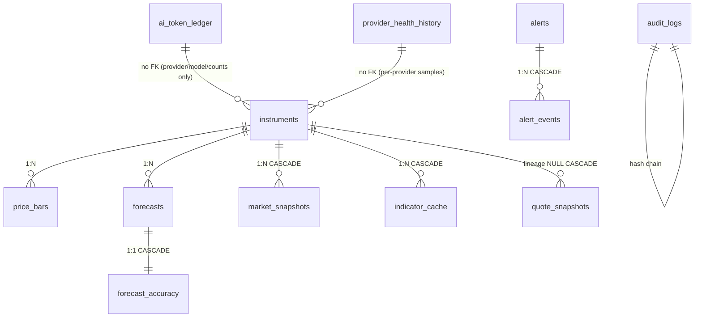

# OneMarket Analyzer — DB schema (0001–0006 revamp)

Additive-only revamp (Backend Agent 7). No existing table/column was renamed,
removed, or retyped. Preserved intact: `forecasts.horizon_days IN (5,21,63)`,
`ai_weight <= 0.20`, alerts condition/horizon CHECKs, calibration horizon
CHECK, and the `audit_logs` append-only hash chain.

## Table inventory

| # | Table | Migration | Purpose | Owner agent |
|---|-------|-----------|---------|-------------|
| 1 | `instruments` | 0001 | Canonical registry (MIC+symbol) | — |
| 2 | `price_bars` | 0001 | OHLCV bars, 5y | — |
| 3 | `forecasts` | 0001 | Versioned forecast log, 3y (+0006 `user_id`/`tier` NULL stubs) | — |
| 4 | `audit_logs` | 0001 | Append-only hash chain, 7y, head never purged | — |
| 5 | `calibration_snapshots` | 0002 | Walk-forward Brier/ECE, indefinite | — |
| 6 | `alerts` | 0003 | Alert rules (+0006 `user_id`/`tier` NULL stubs) | — |
| 7 | `alert_events` | 0003 | Fired-alert events (cascade) | — |
| 8 | `provider_secrets` | 0004 | Fernet ciphertext at rest | — |
| 9 | `provider_budgets` | 0004 | Monthly USD caps | — |
| 10 | `quote_snapshots` | 0005 | Last LIVE quote per symbol (Agent: last-fetched fallback) | — |
| 11 | `market_snapshots` ✨ | 0006 (+0006_snapshots draft, merged) | Compressed snapshots (Agent 3 writer contract) | Agent 3 |
| 12 | `forecast_accuracy` ✨ | 0006 (+0006_snapshots draft, merged) | Per-forecast scores (accuracy.py writer contract) | calibration |
| 13 | `ai_token_ledger` ✨ | 0006 | AI token usage ledger (Agent 4) | Agent 4 |
| 14 | `provider_health_history` ✨ | 0006 | Durable health samples (Agent 6) | Agent 6 |
| 15 | `indicator_cache` ✨ | 0006 | Indicator payload cache | analytics |

✨ = new in 0006. SQLAlchemy: `backend/db/models.py` (appended block, portable
types so SQLite tests stay green). Postgres DDL: `infra/migrations/0006_revamp.sql`;
Supabase twin (+RLS, no anon policies): `supabase/migrations/0006_revamp.sql`.

## ER (new tables + key relations)

```text
instruments 1───* price_bars (instrument_id, timeframe, ts)
instruments 1───* forecasts (instrument_id)
forecast_accuracy (accuracy_id PK; forecast_id NO FK — in-memory records score too)
market_snapshots (symbol-keyed, instrument_id NULL lineage-only, CASCADE)
instruments 1───* indicator_cache (instrument_id, CASCADE)
instruments 1───* quote_snapshots (instrument_id NULL, lineage-only, CASCADE)
alerts 1───* alert_events (alert_id, CASCADE)
audit_logs (standalone hash chain: id, prev_hash -> hash, head never purged)
provider_secrets / provider_budgets (provider PK, standalone)
ai_token_ledger (standalone ledger; evidence_hash -> AI cache key; user_id NULL stub)
provider_health_history (standalone samples; provider, ts)
```

Mermaid:



## New-table columns & constraints

- `market_snapshots(snapshot_id UUID PK, symbol TEXT NOT NULL,
  instrument_id FK NULL lineage-only CASCADE, exchange_mic NULL, ts, timeframe='1d',
  encoding DEFAULT 'gzip+json' CHECK IN
  (gzip+json, delta-q100+gzip, json+gzip, json, zstd, raw), payload BYTEA NOT NULL,
  n_bars/raw_bytes/compressed_bytes INT DEFAULT 0 (writer contract),
  size_raw/size_stored INT >= 0 NULL (revamp mirrors), source,
  quality_grade CHECK IN (A,B,C,D), provenance JSONB '{}', user_id TEXT NULL hook,
  tier TEXT NULL stub, created_at; NO UNIQUE (append-only, latest-wins reads);
  INDEX (symbol, timeframe, ts DESC), (created_at DESC),
  (instrument_id, timeframe, ts DESC), (ts DESC))`
- `forecast_accuracy(accuracy_id UUID PK, forecast_id UUID NULL NO FK
  (in-memory records score too), symbol NOT NULL, exchange_mic DEFAULT '',
  horizon_days, target_date DATE NULL, predicted_prob NUMERIC(6,5) CHECK 0..1 NULL,
  realized_label INT CHECK 0/1 NULL, realized_return NUMERIC(12,8) NULL,
  realized_ret NUMERIC(10,6) NULL (revamp mirror), hit BOOL NULL,
  brier_contrib NUMERIC(10,8) NULL CHECK 0..1, confidence_before/after NULL,
  model_version/data_version DEFAULT '', user_id TEXT NULL hook, tier TEXT NULL stub,
  scored_at, created_at; INDEX (forecast_id), (symbol, horizon_days, scored_at DESC),
  (scored_at DESC))`
- `ai_token_ledger(id BIGSERIAL PK, provider CHECK IN (gemini,openai,anthropic,xai),
  model, call_type CHECK IN (opinion,evidence,forecast,embedding,other),
  input_tokens/output_tokens INT >= 0, latency_ms INT >= 0 NULL,
  evidence_hash NULL, user_id UUID NULL stub, tier TEXT NULL stub, created_at;
  INDEX (provider, created_at DESC), (evidence_hash) partial, (user_id, created_at) partial)`
- `provider_health_history(id BIGSERIAL PK, provider, ts, ok BOOL, latency_ms INT >= 0 NULL,
  error_code NULL; INDEX (provider, ts DESC), (ts DESC))`
- `indicator_cache(instrument_id FK CASCADE, timeframe, indicator_key,
  PK (instrument_id, timeframe, indicator_key), payload JSONB '{}', updated_at;
  INDEX (updated_at DESC))`
- Stubs: `alerts.user_id UUID NULL, alerts.tier TEXT NULL,
  forecasts.user_id UUID NULL, forecasts.tier TEXT NULL`
  (migration-only `ADD COLUMN IF NOT EXISTS`; ORM mapping lands with auth so
  `models.py` stays append-only for concurrent agents).
- `market_snapshots.user_id` / `forecast_accuracy.user_id` are `TEXT NULL`
  (not UUID: they hold UUID *strings* among other future id shapes; no FK).
  `ai_token_ledger.user_id` is UUID NULL. All three converge via
  `ADD COLUMN IF NOT EXISTS`, so apply order between `0006_snapshots.sql`
  (Agent 3 draft) and `0006_revamp.sql` does not matter — but apply ONLY the
  revamp file going forward: it is the canonical UNION (`0006_snapshots.sql`
  stays as the writer-contract draft; its CREATEs are no-ops after revamp).

Preserved CHECKs (unchanged): `forecasts.horizon_days IN (5,21,63)`,
`ai_weight >= 0 AND ai_weight <= 0.20`, `alerts.condition IN (...)`,
`alerts.horizon_days IN (5,21,63)`, `calibration_snapshots.horizon_days IN (5,21,63)`,
`provider_secrets/provider_budgets provider IN (gemini,openai,anthropic,xai)`.

## Retention (backend/observability/retention.py)

| dataset | table | window | time col |
|---|---|---|---|
| ticks | ticks | 90d | ts |
| bars | price_bars | 5y | ts |
| forecasts | forecasts | 3y | created_at |
| forecast_accuracy ✨ | forecast_accuracy | 3y (tied to forecasts; denominators stay consistent) | scored_at |
| market_snapshots ✨ | market_snapshots | 2y uniform (compressed is cheap; per-encoding split deferred) | ts |
| audit | audit_logs | 7y, head never deleted | created_at |
| ai_token_logs | ai_token_logs (legacy) | 1y | created_at |
| ai_token_ledger ✨ | ai_token_ledger | 1y | created_at |
| provider_health_history ✨ | provider_health_history | 90d | ts |
| indicator_cache ✨ | indicator_cache (stale eviction) | 30d | updated_at |

Overrides: `RETENTION_<DATASET>_DAYS` env (e.g. `RETENTION_MARKET_SNAPSHOTS_DAYS`)
or `retention_days={dataset: days}` arg. Missing tables (old SQLite
`onemarket.db`) count as 0 — purge never crashes on degrade.

## SQLite degrade

`models.py` uses portable types (`Uuid`/`LargeBinary`/`JSON`) so
`init_db()` creates all 0006 tables on SQLite; `retention.py` probes
`_table_exists()` per dataset, so a stale `onemarket.db` without 0006 tables
returns 0 instead of raising. Service readers (`_persist_quote_snapshot`
pattern) stay best-effort: wrap new-table I/O in try/except, never 500.

## Rollout (psql apply order)

```sh
# 1. Direct URL only (never :6543 pooler for DDL):
export DIRECT_URL="postgresql://...:5432/..."  # service_role owner
# 2. Baseline first (fresh DBs only; no-ops on existing):
psql "$DIRECT_URL" -f infra/migrations/0001_initial.sql
psql "$DIRECT_URL" -f infra/migrations/0002_calibration.sql
psql "$DIRECT_URL" -f infra/migrations/0003_alerts.sql
psql "$DIRECT_URL" -f infra/migrations/0004_provider_secrets.sql
psql "$DIRECT_URL" -f infra/migrations/0005_quote_snapshots.sql
# 3. Revamp (this task — canonical UNION; supersedes 0006_snapshots.sql draft,
#    which must NOT be applied separately going forward; harmless if it
#    already was — ADD COLUMN guards converge the schema either order):
psql "$DIRECT_URL" -f infra/migrations/0006_revamp.sql
# 4. Re-run 0006 to prove idempotence (must exit 0, no schema drift):
psql "$DIRECT_URL" -f infra/migrations/0006_revamp.sql
# Supabase Dashboard alternative: paste supabase/migrations/0001..0006 in order,
# then supabase/seed.sql (seed unchanged: 3 instruments, ON CONFLICT DO NOTHING).
# 5. Verify: python -m pytest backend/tests/test_db.py \
#      backend/tests/test_retention.py backend/tests/test_audit.py -q
```

Rollback: 0006 is additive — rollback = stop writing new tables (reads degrade
to empty/memory fallback); no data migration to reverse. `DROP TABLE IF EXISTS
market_snapshots, forecast_accuracy, ai_token_ledger, provider_health_history,
indicator_cache` only if the revamp must be fully unwound, plus
`ALTER TABLE alerts DROP COLUMN IF EXISTS user_id/tier` (same for forecasts).

## Coordination (do-not-break list)

- Agent 3 (snapshots): `save_snapshot`/`load_latest_snapshot` in
  `backend/market_data/snapshot_store.py` own the `market_snapshots` writer
  contract (symbol-keyed, `gzip+json`/`delta-q100+gzip` encodings,
  `n_bars`/`raw_bytes`/`compressed_bytes`, nullable lineage `instrument_id`,
  TEXT `user_id`). MERGED 2026-09-15: one class per table — writer columns
  kept verbatim, revamp only ADDED `size_raw`/`size_stored`/`tier` + safe
  CHECKs; no UNIQUE (append-only, latest-wins). Do not re-add a second
  `MarketSnapshot`/`ForecastAccuracy` class (duplicate `__tablename__` is a
  hard import crash for every test).
- Accuracy owner: `score_due_forecasts` in `backend/forecasting/accuracy.py`
  owns the `forecast_accuracy` writer contract (`accuracy_id` PK, NO FK on
  `forecast_id`, full scoring columns). MERGED 2026-09-15: revamp only ADDED
  `realized_ret`/`tier` + scorer-guaranteed CHECKs. Retention 3y is tied to
  the forecasts window so denominators stay consistent (rescore-after-purge
  is impossible: forecasts purge first).
- Agent 4 (AI): appends `ai_token_ledger` rows per call (never secrets);
  `evidence_hash` joins the AI cache key; 1y retention matches token budget audits.
- Agent 6 (health): appends `provider_health_history` samples; live
  `ProviderHealthTracker` interface unchanged.
- Auth/tiers (future third DB): `user_id UUID NULL` (no FK) + `tier TEXT NULL`
  on `market_snapshots`, `ai_token_ledger`, `alerts`, `forecasts` only.
  No auth logic, no RLS policies for anon (Supabase: RLS enabled, zero policies,
  service_role bypasses).
